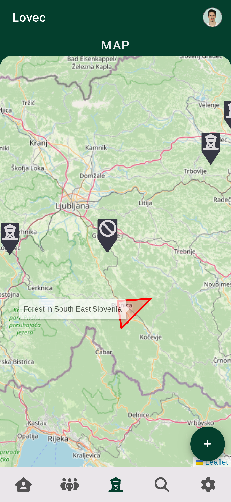

# About The Project

Lovec aims to digitise the hunting industry by transferring the current processes in the hunting industry into a digital format that is accessible to users on their mobile device. The software solution allows users to organise common hunting parties, view and book observation posts, tour districts and information about their families, manage trainees’ logbooks and the trainees’ own entry of these logbooks, view and manage equipment and, finally, the entry and checking of entries. In addition, it also includes a view for the system supervisor, who can modify the workflow management of the application. The application is written using the Ionic and Vue.js frameworks.

## Features

### User Roles

The Lovec mobile application contains several different user roles. Each has available functionalities and adapted views.
The roles in the application are as follows: administrator and user. The user role has two specializations: hunter and trainee.

#### User

The user role is a set of functionalities available to both hunters and trainees.

#### Hunter

A hunter accesses the same functionalities as a user, but it includes some additional functions that are not available to the user. Each hunter can have zero or more trainees whom they mentor. Each trainee enters logs describing the work they have done and how much time they spent on it.

#### Trainee

A trainee functions similarly to a hunter, as it extends the functionalities available to the user by providing access to the log entry functionality. Each trainee has their mentor to whom they report their work. Therefore, they have their own view where they enter logs about completed tasks. When the mentor sees their logs and confirms or rejects them, the trainee also sees this in their logs.

#### Administrator

The administrator has access to completely separate functionalities from the previously listed user roles. The only view shared with other roles is the one that allows logging into the mobile application. The application then redirects them to views accessible only to them. The administrator primarily has functionalities that have a direct impact on the operation of the entire mobile application infrastructure.

### Login

As already mentioned, the login view is accessible to both main roles: user and administrator. This view provides a single entry form through which any user role can log in. For a successful login, the user must enter the correct combination of username and password; otherwise, a message about incorrect login credentials is displayed, and the login attempt is rejected.

<p align="center">

</p>

#### User

##### Hunts View

The user can view hunts. For each hunt, the organizer, date of the hunt, title, description, and any participants are displayed. By clicking on a hunt, the user can open the remaining details that are not shown on this page. The button in the lower right field allows us to create a new hunt. The view is divided into three sections.

**Active** -- this section displays all hunts that have not yet started. This gives the user the opportunity to view hunts and also to join if there is enough space and they are not yet a participant.
**Past** -- this section displays all hunts that have already concluded. Here, the user has an overview of all completed hunts.
**Mine** -- this section displays all the hunts the user has participated in. This includes hunts the user has joined and those they have organized themselves.

<p align="center">

</p>

##### Hunt Input

The user can add hunt details. They must specify the start date and time, location, title, and description.

<p align="center">

</p>

##### Hunt Details View

The user can view the details of a hunt.

<p align="center">

</p>

##### Equipment View

The user can keep a record of their hunting equipment. Only the equipment they have entered themselves by clicking the button in the bottom right corner is listed here. For each piece of equipment, the name, category, condition, and date of entry are displayed. In addition, the user can freely delete entries.

<p align="center">

</p>

##### Equipment Input

The user can enter equipment by providing details about their equipment.

<p align="center">

</p>

##### Catches View

The user can make multiple catches in the same day, which they may then want to view. The catches view allows for the display of details for catches. This allows the user to more quickly review the history of their catches and have a quick overview of catches for several days. If they want to look at the catches of a certain day in more detail, they can do so by pressing on the catch. They can also add catches by clicking the button in the bottom right corner.

<p align="center">

</p>

##### Profile View

Each user can view their user profile. Here, their role, mentor or trainees (if the user is a hunter and has trainees), and family are displayed. A QR code is also displayed, with which the user can identify themselves to the game warden.

<p align="center">

</p>

##### Map View

The map is one of the main functionalities available in the mobile application. Here, the user has the option to view observation posts, the hunting ground, and their active visit. They can reserve an observation post if it is free and if the user has enough remaining minutes for visits to observation posts on that day. When this is done, information about the active reservation and the option to cancel it appears at the top of the map.

<p align="center">

</p>

#### Hunter

##### Trainee Log View

The mentor hunter has an overview of the logs of all their trainees. If the hunter does not mentor trainees, then they will not have access to the logs, as these are logs that the user must enter themselves. They can check the logs for each day separately. For each entry, they have insight into who entered the log, the work category, when the work was done, and the description of the work itself. The mentor then decides whether to accept or reject the log. This is done by clicking on one of the icons in each log.

<p align="center">

</p>

#### Trainee

##### Log Input

If the mentor has an overview of their trainees' logs, then the trainee must also have the option to enter a log. In doing so, they fill in all the log data themselves and enter it. Then they wait for the log to be confirmed by the mentor.

<p align="center">

</p>

##### Trainee Log View

After the user enters a log, it will also be visible among any other logs that the user has already entered. The logs will be colored green or red when the trainee's mentor confirms or rejects them.

<p align="center">

</p>

#### Administrator

##### Map Overview

The map display allows the administrator, as well as the hunter and user, to view all observation posts and hunting grounds. According to business constraints, the administrator is not a user who can reserve an observation post. However, they have the power to enter and delete observation posts and view visits. In addition, they also have the power to enter new hunting grounds.

<p align="center">

</p>

##### Hunts Overview

The hunt display is also available to the regular user, but there we show the hunts in which the user has participated. One of the business constraints here is that the administrator does not have the option to participate in a hunt, so the view is adapted accordingly. However, it still allows them to view all active hunts. They can open or delete hunts.

<p align="center">

</p>

##### Hunting Families Overview

The administrator has an overview of all families. This can be seen in a list where, in addition to the name of each family, the number of members and how many hunting grounds they manage are also displayed. Each family can also be deleted by pressing the delete button. By clicking the button in the bottom right corner, they have the option to create a new family, and by pressing on the family itself, the details open up.

<p align="center">

</p>

##### Users Overview

The mobile application allows for an overview of all system users. In addition to the overview of all users, the application also allows searching for users by name. The user's first name, last name, profile picture, and user role are displayed. For each user, the administrator has the option to view the profile and also the option to delete. By clicking the button in the bottom right corner, they can create a trainee, a hunter, or even an administrator.

<p align="center">

</p>

##### User Profile View

When selecting a user or administrator, the administrator has a view of their profile. This displays data about the selected user. In the case of an administrator, the profile picture and role will be displayed. A mentor will also have data on trainees and family, while a trainee will have data on their mentor. The administrator can also access the users' pages themselves by clicking on one of the entries. This gives them the same view as the user themself. In doing so, they also have the power to change details for both users and administrators.

<p align="center">

</p>

##### System Data Overview

The system data overview allows the administrator to manage some business constraints directly from the mobile application. In this way, they can change various system parameters so that they have an immediate effect. They have several entries available.

<p align="center">

</p>

**Revision** indicates when the last change was made to these variables. With each change, this data is recorded and is always available to the administrator for insight as a record of changes.

**Page size** indicates how many elements the server returns in the case of a request for a resource that offers multiple pages.

**Maximum number of hunt members** indicates the maximum number of users, hunters, or trainees that can participate in a single hunt.

**Maximum visit duration** indicates how many minutes a single reservation of an observation post can last. This is counted towards the quota of minutes allowed by the next entry.

**Maximum user visit duration** indicates how many minutes a day a hunter can spend in an observation post. With each minute of reservation, this sum decreases. Each day, these quotas are reset for each user, so the hunter or trainee has a newly allocated quota of visit duration the next day.

## Built with

Frontend

- Vue.js
- Ionic and Capacitor
- Pinia State Management
- TypeScript

Backend

- TypeScript
- Node.js
- Express.js
- MongoDB
- JSON Web Tokens

## System Architecture

### Data model


### DPU diagram


| Use case                               | Description                                                                                      |
| -------------------------------------- | ------------------------------------------------------------------------------------------------ |
| Training logs view                     | The trainee has the option to view their logs and their status                                   |
| Training log input                     | The trainee has the option to enter a log about completed work                                   |
| Hunts view                             | The user has the option to view active and past hunts                                            |
| Hunt input                             | The user has the option to enter new hunts                                                       |
| Hunt information view                  | The user has the option to view the details of a hunt                                            |
| Equipment view                         | The user has the option to view their equipment and the option to delete it                      |
| Equipment input                        | The user has the option to enter their equipment                                                 |
| Catches view                           | The user has the option to view their catches by date                                            |
| Catch input                            | The user has the option to enter a catch                                                         |
| Catch information view                 | The user has the option to view the details of a catch                                           |
| Profile view                           | The user has the option to view their user profile                                               |
| Map view                               | The user has the option to view a map with marked observation posts and hunting grounds          |
| Obsevation post reserve                | The user has the option to reserve an observation post and view any existing active reservations |
| Observation post information view      | The user has the option to view the details of an observation post                               |
| Trainee logs view                      | The hunter has insight into the logs of their trainees and the option to approve or reject them  |
| Map overview                           | The administrator has an overview of the map with observation posts and hunting grounds          |
| Observation post management            | The administrator has the option to change the properties of an observation post                 |
| Observation post reservations overview | The administrator has insight into the visits of an observation post                             |
| Hunts overview                         | The administrator has an overview of active and past hunts                                       |
| Hunt management                        | The administrator has the option to manage a hunt                                                |
| Families overview                      | The administrator has an overview of all families                                                |
| Family input                           | The administrator has the option to enter a new family                                           |
| Family management                      | The administrator has the option to manage a family                                              |
| System overview                        | The administrator has an overview of all system properties                                       |
| System management                      | The administrator has the option to manage system specifics                                      |
| Users overview                         | The administrator has an overview of all users                                                   |
| User profile overview                  | The administrator has an overview of a user's profile                                            |
| User profile management                | The administrator has the option to edit a user's profile                                        |
| User input                             | The administrator has the option to enter a new user                                             |
| User hunts overview                    | The administrator has an overview of a user's hunts                                              |
| Training logs overview                 | The administrator has an overview of a user's logs                                               |
| User post visits overview              | The administrator has an overview of a user's visits                                             |
| User catches overview                  | The administrator has an overview of a user's catches                                            |
| User catch information overview        | The administrator has an overview of the details of a user's catch                               |
| User equipment overview                | The administrator has an overview of a user's equipment                                          |

# Getting started

To get started you need to complete the following steps.

## Prerequisites

- TypeScript 5 or higher
- Node.js 20 or higher
- ts-node 10 or higher
- MongoDB database instance

## Installation

### Configuration

In order to provide API access to the bot, you need to create a `.env` file in the root directory of the project and add the following variables:

Frontend:

```bash
VITE_API_URL
```

Backend:

```bash
PORT
MONGO_URI
NODE_ENV
JWT_SECRET
VUE_APP_API_URL
FILE_UPLOAD_PATH
FILE_UPLOAD_PATH_PROFILE
```

### Setup

1. Provide `.env` files in `src/client` and `src/server` directories
2. Install Node.js and TypeScript
3. Clone the repository
   `git clone https://github.com/janmerhar/lovec`
4. Install the required packages in the `src/client` and `src/server` directory
   `npm install`

## Usage

Start the backend server by running the following command in the `src/server` directory:

```bash
npm run dev
```

Start the frontend server by running the following command in the `src/client` directory:

```bash
npm run dev
```

## Contributing

To contribute to this project follow these steps:

1. Fork the repository
2. Create feature branch (`git checkout -b feature/NewFeature`)
3. Commit changes (`git commit -m 'Add some changes'`)
4. Push to the branch (`git push origin feature/NewFeature`)
5. Open a pull request
